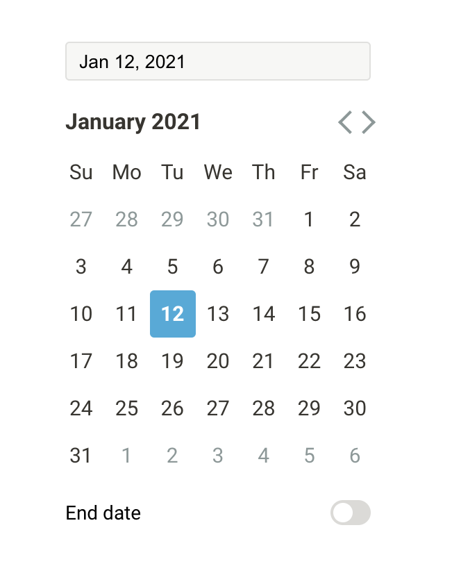

# react-calendar

About The Project

This project is a simple clone of the datepicker used by the notion app. This datepicker was created while drawing inspiration from [react-datepicker](https://github.com/Hacker0x01/react-datepicker) and [date-fns](https://github.com/date-fns/date-fns).

Live example:
[Notion-datepicker](https://ntion-calendr-7d2f88.netlify.app/)

## Built With

Create-react-app
